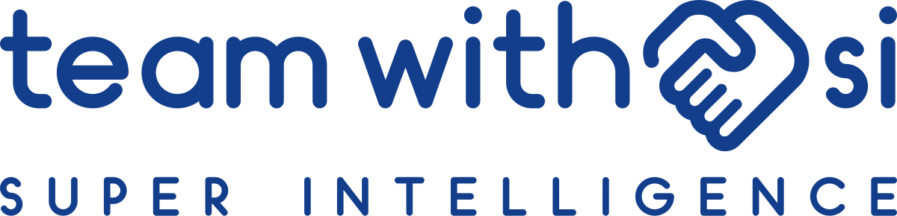

# teamwith.si 品牌标志



teamwith.si 读作 team with Super Intelligence，和超级智能组队。

- **点即握手**：域名 teamwith.si 中间的「.」换成一次握手。
- **握手即心**：两只手合起来的外轮廓是一颗心。
- **一支笔**：字母、握手、产品图标都用同一支单线圆头笔画成（x 高 100，笔画 20），整串字本身就是标志。

完整规范见 [`guidelines/index.html`](guidelines/index.html)（浏览器直接打开），包括标准制图、安全空间、最小尺寸、标准色、字体、子品牌规则、应用示范和禁用示例。

## 文件

- `logo/teamwith-si.svg`：主标志（含全称 SUPER INTELLIGENCE），另有 `_white`、`_black`
- `logo/teamwith-si_logotype.svg`：简标（不含全称），宽度小于 200 px 时使用
- `logo/teamwith-si_mark.svg`：握手图形
- `logo/teamwith-si_app-icon.svg`：App 图标，PNG 为 1024 / 512 / 180 px
- `logo/favicon.ico`、`logo/favicon.svg`：网站图标（加粗版，适合 16 / 32 px）
- `logo/png/`：各版本透明底 PNG
- `logo/square/`：1:1 方形标志（握手、Si），蓝底 / 白底 / 透明
- `products/filemaster/`：filemaster.teamwith.si 组合、简标、文件图标
- `guidelines/index.html`、`guidelines/brand-book.pdf`：品牌手册（网页版 / A4 PDF）
- `guidelines/usage-guide.pdf`：标志包使用说明（4 页 A4）
- `source/`：生成以上全部文件的脚本

## 要点

- 颜色：皇家蓝 `#123E8C`（RGB 18 62 140，CMYK 87 56 0 45）；深色底用深夜蓝 `#0B2554`；单色稿用纯白或纯黑。
- 安全空间：四周至少 1 个 x 高。
- 最小尺寸：主标志 ≥ 200 px / 45 mm；简标 ≥ 96 px / 22 mm；小于 32 px 用 favicon 加粗版。
- 标志字是定制绘制的，没有对应字库，请直接使用标志文件，不要用字体重新打字。

## 子品牌

子域名里的每一个「.」都换成该产品的图标。以 filemaster.teamwith.si 为例：

```
file master  [文件图标]  team with  [握手]  si
                                SUPER INTELLIGENCE
```

- 产品名用同一套单线字，全部小写，放在最前面。
- 产品图标用同一支笔（20 单位、圆头），站在降部线上，高度为握手的 0.9 倍。
- 图标两侧留 22 单位光学间距。
- 主标志连同全称整块不动，前缀只在左侧拼接。

新增产品时在 `source/lockups.py` 里调用 `product_lockup('产品名', 图标几何)`，再加进 `source/build.py` 即可。

## 重新生成

```bash
cd brand/source
pip install -r requirements.txt
python build.py        # 标志文件
python guidelines.py   # 品牌手册（网页版）
python package.py      # 全部文件 + 使用说明 + 手册 PDF 打包到 brand/dist/teamwith-si_brand_v1.0.zip
```

`package.py` 用 headless Chromium 把手册和使用说明渲染成 PDF，需要 Node.js 和 Playwright。

## 授权

- 握手图形改自 Google Material Symbols「handshake」（rounded，weight 700），Apache License 2.0，原文件与许可证见 `source/vendor/material-symbols/`。
- 字母为本项目定制绘制，不含任何字库字体。
- 手册页面引用的 Nunito、Noto Sans SC、IBM Plex Mono 均为 SIL Open Font License。
